# Git 使用方法

## 初次使用

Git : [Git - Downloads](https://git-scm.com/downloads)

Marktext : https://www.marktext.cc/

以下將示範初次使用之步驟

> 建立一個資料夾

> 在這一個資料夾開啟`Terminal`

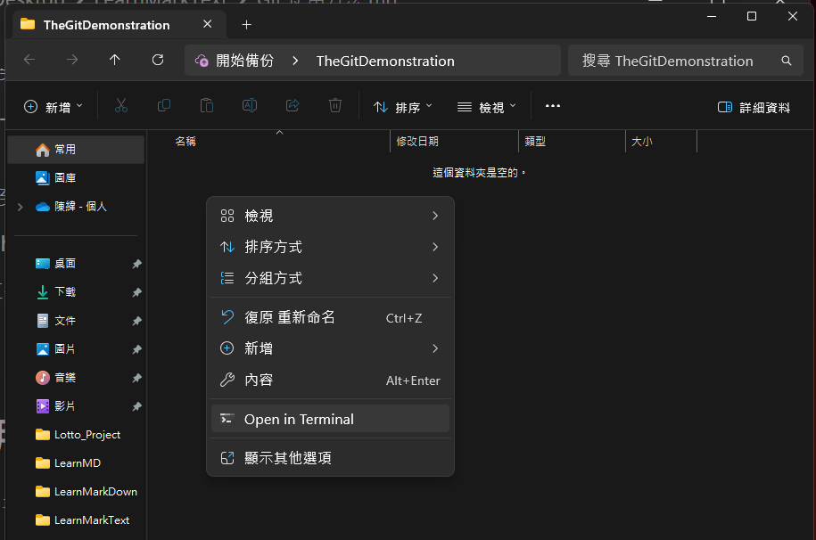

> 初始化一個新的Git倉庫

- git init

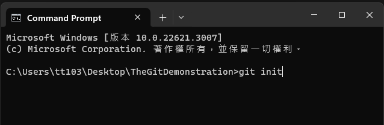

> 檢查該資料夾中是否成功建立一個.git的隱形資料夾

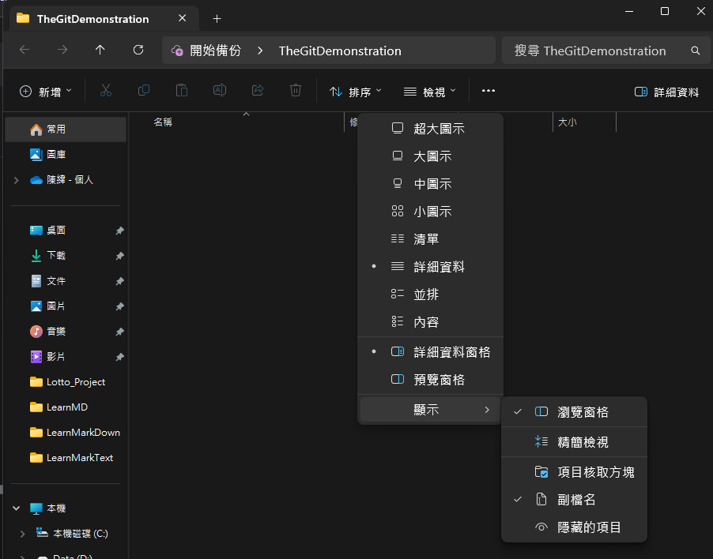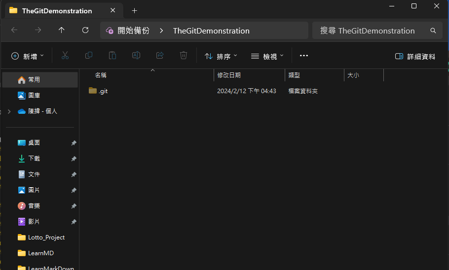

> 在Terminal設定git的`config`

- git config --global user.email "輸入你的電子信箱"

- git config --global user.name "輸入你的名字"

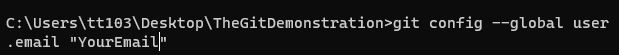

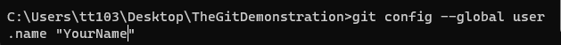

> 在github中建立一個新的`repository`

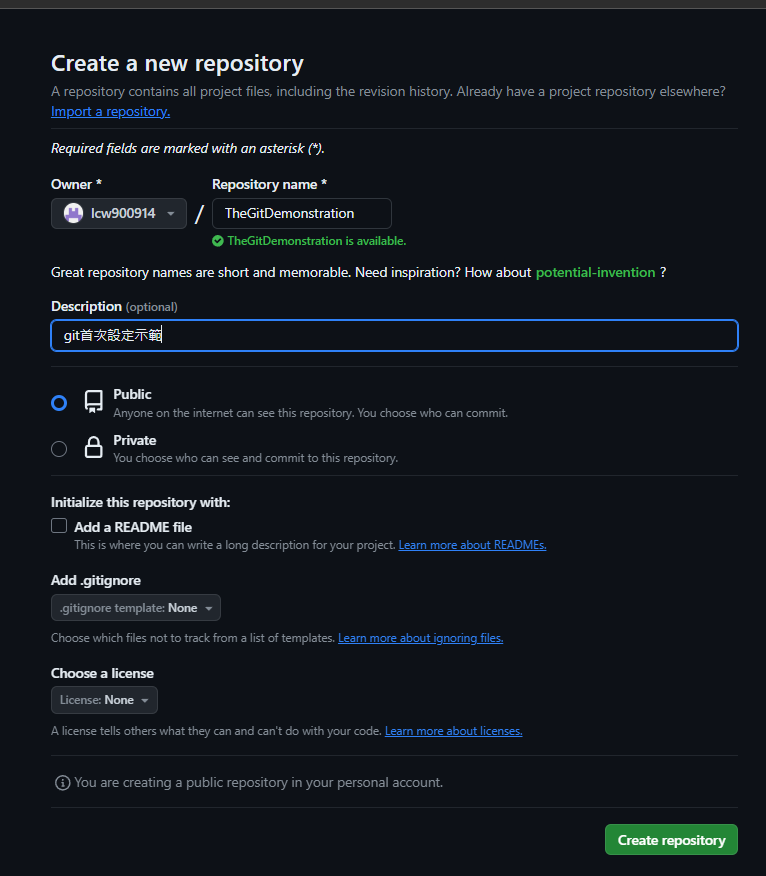

> 回到Terminal連接`repository`

- git remote add origin `RepositoryUrl`

> 隨便新增一個文件並輸入一些內容

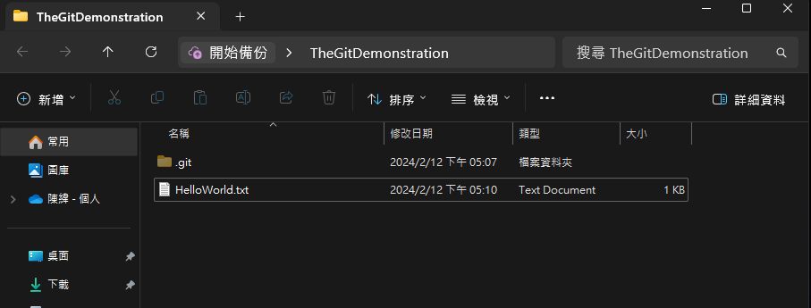

> 回到Terminal將文件或整個資料夾`add`並`commit`

- git add .

- git commit -m "Test"

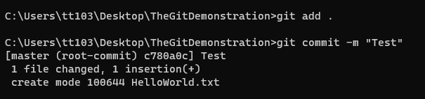

> 最後`push`到`repository`

- git push origin master

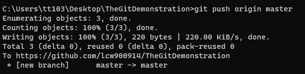

> 至該`repository`檢查是否上傳成功

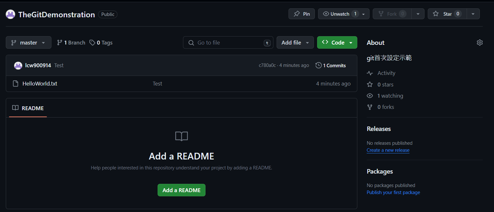

## 指令說明

- git init
  
  這一個指令會在你所在的目錄下初始化一個新的Git倉庫。並且會新增一個名為.git的隱藏資料夾，這一個資料夾包含了Git倉庫所有設定及版本控制的資訊。初始化過後就可以使用Git指令管理專案了。

- git status
  
  顯示已修改但還沒add的文件，以及已經add但還沒有commit的文件，以及當前分支branch的名稱以及是否遠端分支同步。

- git add flie or folder

        將文件或資料夾添加至暫存器中。

- git commit -m "Input your interpretation"
  
  將暫存區中的更改保存到本地版本庫中。這個指令表示你已經確定了你的更改並準備好將它們永久地記錄在你的版本控制歷史中。

- git push
  
  將當前分支的`commit` push到遠端倉庫中。通常情況下，可以直接運行 `git push`，而不需要指定任何其他的參數，因為 Git 會根據你當前所在的分支和遠端設定自動找到對應的遠端倉庫和分支。

- git push origin [分支名]

        多一個指定分支，略。

- git branch
  
  列出本地所有的分支，若某個分支前面有一個星號 (*)，表示這是當前所處的分支。
  
  如果想看到遠端分支（即存儲在遠端倉庫中的分支），可以使用 `git branch -r` 指令；如果想同時看到本地和遠端分支，可以使用 `git branch -a` 指令。

- git branch [分支名]
  
  新增分支的方法。

- git checkout [分支名 or hashcode]
  
  用於切換到指定分支或特定提交的指令。

- git reset --hard [hashcode]
  
  這將會將 HEAD 指向提交 `hashcode`，並且刪除所有未提交的更改，將工作目錄和暫存區恢復到提交 `hashcode`的狀態。

- git branch -m [old name] [new name]

        更改分支名。
