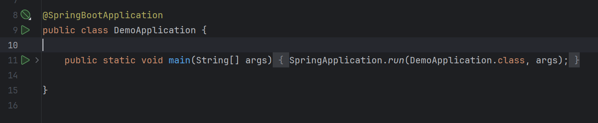
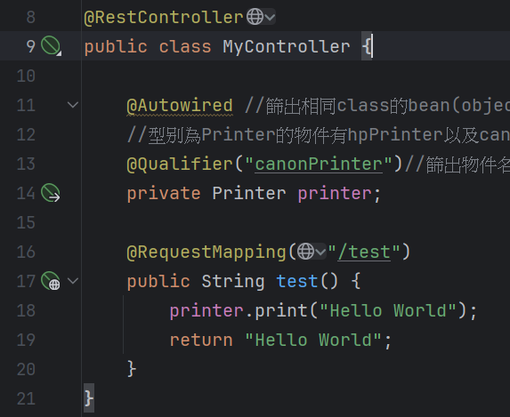
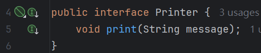
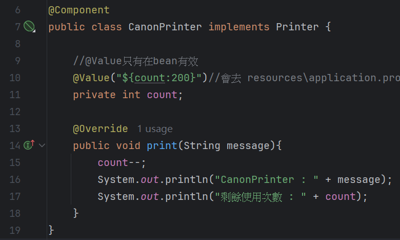
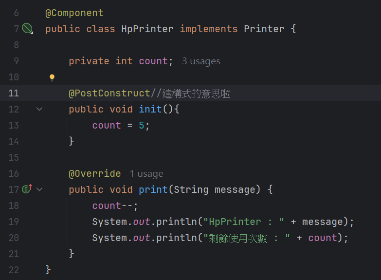
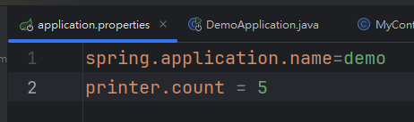
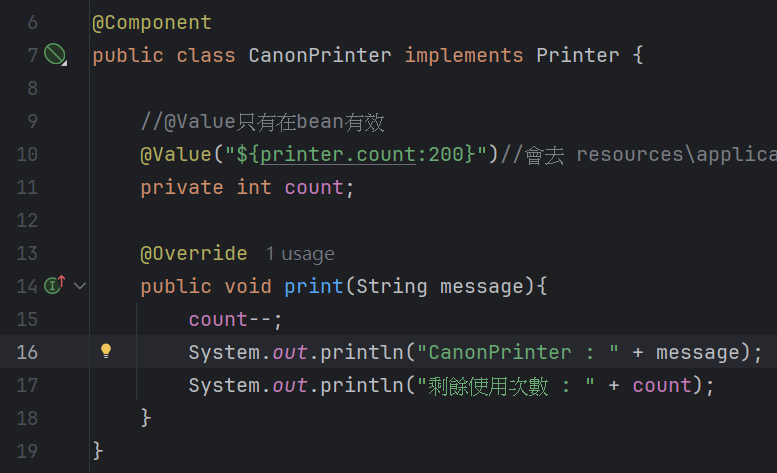

# Spring Boot-簡介+基礎介紹

​	Spring Boot是一個Java後端的開發框架，這個框架使工程師可以快速建立一個後端系統，工程師的角色從每一個零件的開發與串接，變為專注於邏輯與功能的開發。

## IOC控制反轉

​	將物件控制權交給外部Spring容器管理，這使得我們不需要去new一個object出來，僅在需要時向Spring容器要。

​	這使得class之間耦合度降低、物件的生命週期由Spring管理，也因此我們在進行單元測試時更加方便。

## DI依賴注入

​	IOC中說到我們不需要去new一個object出來，僅需要在需要時去借，此時Spring容器就會將你要的object注入到你所在的class。

## Bean物件

​	就是由Spring容器管理的物件，物件名稱會是第一個字母是小寫的class名稱。

## AOP切面導向程式

​	古古利用計時器來舉例，print要計時器、printColor也要計時器，他們有一格共同的邏輯，卻需要在各自的程式	碼中複製計時器	程式碼，當量大時相當麻煩，所以使用AOP，將開始時間與結束時間都作為一個切面，讓print與printColor被切面橫貫，他們只需要	做好自己該做的，切面會幫忙計算時間。***所以簡單來說AOP就是在透過切面，統一處理方法間的共同邏輯。***

## Annotation註記 標註

​	程式碼中我們會常常看到@...，這個@叫做annotation標註，以下來介紹幾個常用的annotation。

### 	@SpringBootApplication

​		表示DemoApplication.class是這個Spring Boot程式的進入口。

## 	

	### 	@RestControll & @RequestMapping

​		須補

	### 	@Component & @Autowired

​		在class前一行加入@Component，使這一個class可以變成Bean。

​		而@Autowired 則加在呼叫者前一行，告訴容器需要此類Bean。

​		注意需要仰賴注入的class自己本身也必須要可以被注入，也就是說他也必須是一個Component。且必須注意Spring容器會依照		變數類型來尋找將被注入的Bean，所以我們須注意到多型，一個實現interface的class可以被向上轉型成為interface的類別，我		們必須要注意是否有(@Autowired的變數型別)的Bean存在Spring容器中。若無將會失敗。

### 	@Qualifier(string:objectName)

​		而如果在容器中存在一個以上同一個類型的Bean，我們就必須要指名道姓的說要哪一個，不然Spring容器不知道要給你哪個。

### 	@PostConstruct

​		初始化Bean的建構式，在建構式上方加這個annotation即可。須注意函式必須為public void，且不可以有參數。

### 		Spring Boot 設定檔

​			 ./src/main/resources/applicaiton.properties，專門存放Spring Boot程式的設定值。

​			寫法是key:value     key可以用. 例如printer.count

#### 		@value("${key}")

​			如果變數寫在設定檔中，我們可以用這個方法去讀取，記得key要跟設定檔中一樣。可以在key後面加上一個value，他會在			找不到設定檔資訊時拿來用@value("${key:30}")。

