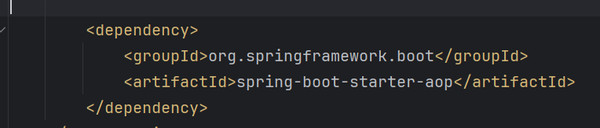

# AOP使用方法

​	pom.xml載入Spring AOP，插入後記得案右上角的M。



​			


​	 & @After(切入點)

​		這兩個annotation代表某個函式執行前的切面以及執行後的切面。注意只能寫在@Aspect @Component 的class。


## 	@Around(切入點)

​		這個annotation代表某個函式執行前後的切面。(之後去理解一下原理)


## 	所謂參數-切入點...

```
"execution(* com.example.demo.HpPrinter.print())"  //切入點為 com.example.demo.HpPrinter的print()方法
```

```
"execution(* com.example.demo.HpPrinter.*(..))"  //切入點為 com.example.demo.HpPrinter 底下的所有方法
```

```
"execution(* com.example.demo.*(..))"  //切入點為 com.example.demo 此package下所有方法 不含子package
```

```
"execution(* com.example.demo..*(..))"  //切入點為 com.example.demo.HpPrinter 此package下所有方法 含子package
```

```
@annotation(com.example.demo.MyAnnotation) //切入點為帶有@MyAnnotation的方法 -> 我認為重要的
```

