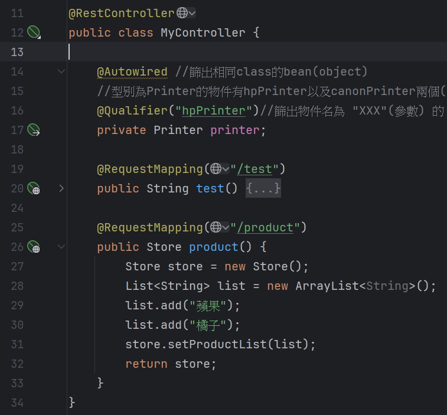

# Spring MVC

​	前端負責顯示與排列商品，後端負責處理數據，Spring MVC可以創建出api，作為前端與後端的溝通橋樑。

​	前幾周的實作環節，我們透過查詢http://localhost:8080/test 來執行MyController中的test方法，之所以可以透過此網址來操作程式，

​	是因為在MyController.class中@RestController以及@RequestMapping()這兩個annotation。

## @RequestMapping 

​	這是一個路徑對應的annotation，他將url路徑去對應到方法，以利前端request調用方法。在使用這個annotation時，一定要在此class上方加入@Controller 或是 @RestController，否則@RequestMapping不生效。

## @RestController & @Controller

​	這兩東西差不多，都是加在class之前，使class可以成為bean，以及使class中的@RequestMapping生效。不同的地方是回傳型別，@RestController回傳型別會自動轉換成Json，@Controller回傳的型別會是前端模板的名字。(這個前端模板的名字是甚麼意思，目前不懂，之後去問)

## 要如何將回傳型別變成Json格式

​	除了上面說到的@RestController，我們必須將返回值變成一個物件。舉例來說如果我們要返回一個學生的訊息，我們必須寫一個學生的class並new成物件，可以進行完學生資料的操作後直接回傳此學生的物件。以下分別為Store類別定義、@RestController類別與response結果，可以看到我們成功回傳自訂義的Store的Json格式。

# HTTP request & response 格式

- Http Method : 請求方法，可以是GET, POST, PUT, DELETE。

- url : 網址，通常結構為 協定://域名:port/路徑，其中路徑就是透過@RequestMapping(路徑)來對應此annotation下方方法。

- Request header

- Request body : 放請求的參數，只有在POST, PUT...等請求方法時，使用Request body來傳遞參數

  

- Http status code : 表達請求的結果如何，成功或失敗。
- Response header
- Response body : 放後端要傳給前端的數據。

​	利用API Tester來看看範例程式的前後端傳輸(古古的範例)

​	狀態碼200代表http請求成功，所以後端將返回值放在Response body中。

	## 	request method
	
			- GET : 前端只能夠將參數放在url的最後面，這些參數被稱為query parameter。
			- POST : 前端只能夠將參數放在request body中，且通常是json格式，因為request body會被封裝，所以參數不會洩漏。

### Http status code :

 - 1xx : 資訊

 - 2xx : 成功 01-> Created success 02->Accepted but not yet finish

 - 3xx : 重新導向 01->永久性重新導向(網頁搬家)

   ​			02->臨時性重新導向

   ​			01 & 02 : 新的Url放在response header的"Lacation"返回

 - 4xx : 前端請求錯誤  00->參數錯誤

   ​				01->未通過身分驗證

   ​				03->請求後端被拒絕 (權限不足)

   ​				04->網頁不存在

 - 5xx : 後端處理錯誤  00->後端執行程式錯誤

   ​				03->臨時維護或流量過大 目前無法處理請求

   ​				04->請求超時

   ​				

# Spring Boot 如何接住前端的參數

​	四個不同功能的annotation，想要接住前端所傳參數，需要依照情況來選擇適合的annotation。

 - @RequestParam : 當前端使用GET方法來request時，用此annotation來接住放在url後面的參數。
 - @RequestBody : 當前端使用POST方法來request時，用此annotation來接住放在request body中的參數。
 - @RequestHeader : 接住放request header中的參數，通常會將「權限認證」「通用資訊」放在request header傳遞。
 - @PathVariable : 去路徑中找參數 wtf?  **為了支援 RESTful API 的設計風格**

​	以下為四個annotation的使用範例

## @RequestParam

一個參數時

​	

結果

注意，請將前端後端參數設為一致(有方法可以不一致)，但初學階段先不要亂搞。如果有一個以上的參數請用&來間隔。

多個參數

結果

	## @RequestBody

Student class 這個class要與request body中的json契合

參數直接放物件來接json

結果

## @RequestHeader

## @PathVariable

注意 類型要一致

## MVC架構模式

​	將一個系統拆分成Model,View,Controller，每個部份各自分工不同功能。

### 優點

- 職責分離:易維護
- 程式結構化:利於團隊分工
- Model可重複使用

### Spring Boot套用MVC架構

​	Model,View,Controller將轉化為Controller,Service,Dao架構。

#### 	規則	

​		1.命名結果要是當層名稱例如StudentController,StudentService,StudentDao

​		2.三種class都要可以成為Bean，也就是class上方要掛@Component與new時要掛@Autowired

​		3.Controller不能直接使用Dao。

​		4.Dao只能執行SQL語法

