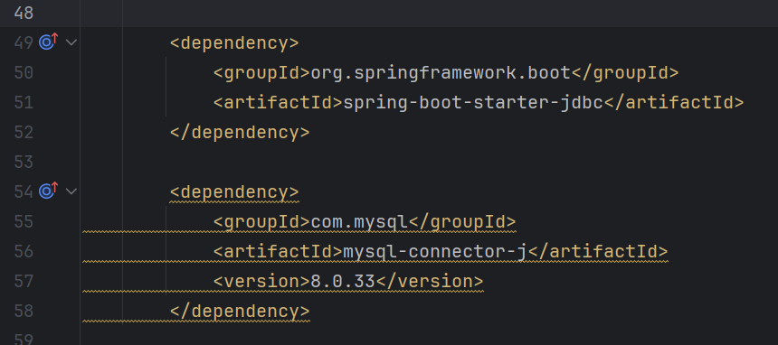
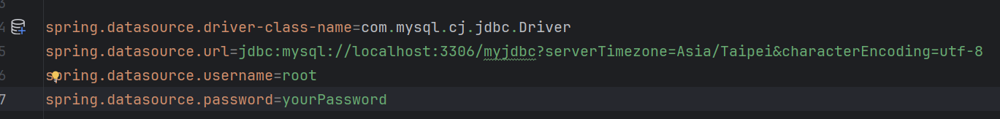
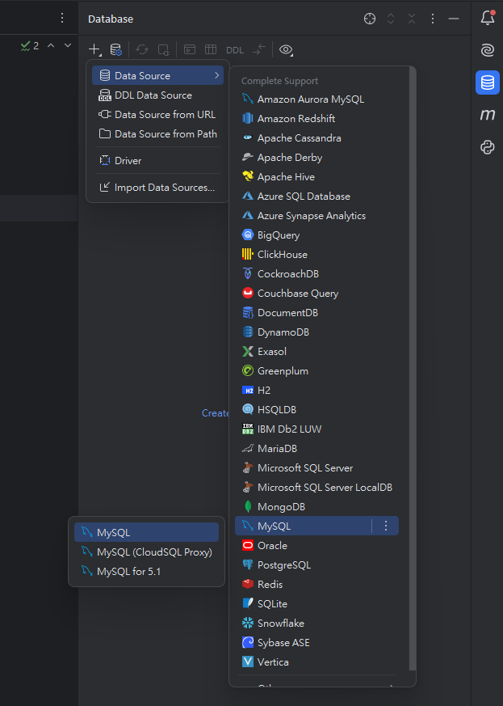
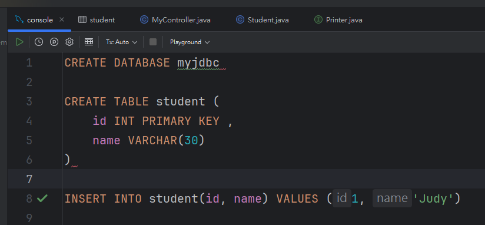
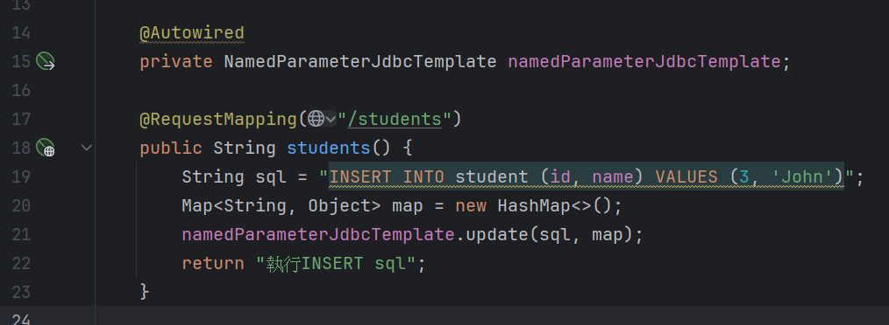
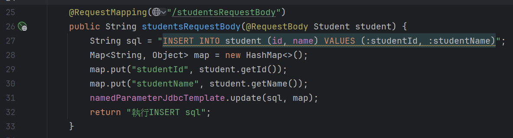
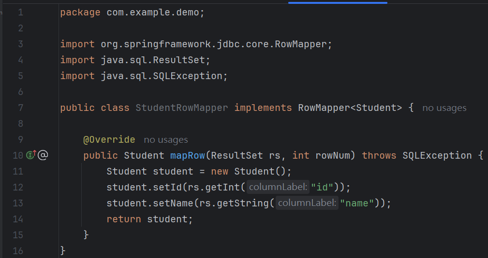
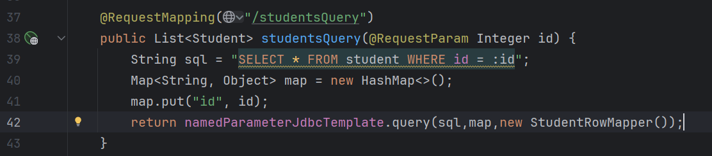
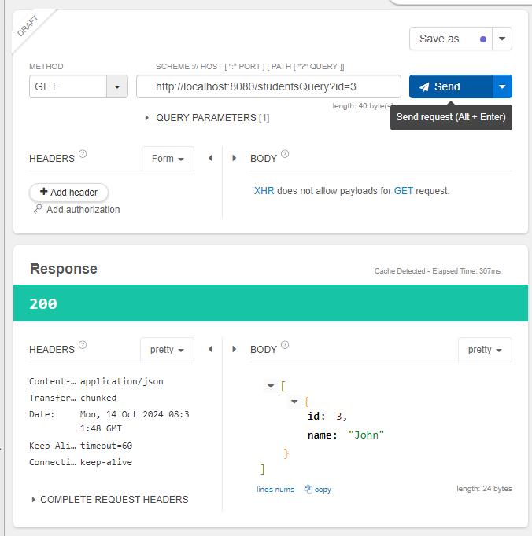

# SQL使用方法

​	載入Spring JDBC以及資料庫Driver



``````
<dependency>
    <groupId>org.springframework.boot</groupId>
    <artifactId>spring-boot-starter-jdbc</artifactId>
</dependency>

<dependency>
    <groupId>com.mysql</groupId>
    <artifactId>mysql-connector-j</artifactId>
    <version>8.0.33</version>
</dependency>
``````


​	在resources/application.properties輸入



``````
spring.datasource.driver-class-name=com.mysql.cj.jdbc.Driver
spring.datasource.url=jdbc:mysql://localhost:3306/myjdbc?serverTimezone=Asia/Taipei&characterEncoding=utf-8
spring.datasource.username=root
spring.datasource.password=springboot
``````

### 解釋

​	spring.datasource.url=jdbc:mysql://localhost:3306/myjdbc?serverTimezone=Asia/Taipei&characterEncoding=utf-8

​	->連到自己電腦的MySQL，指定連線到MySQL的myjdbc這個DB，後面兩個參數代表時區以及使用編碼。


建立一個DB




建立並定義TB，插入一項資訊




Spring JDBC 根據是否會改變資料庫內容來分類出兩種方法，分別是會改變資料庫的update()以及不改變資料庫的query()。

INSERT, UPDATE, DELETE 三種sql語法就要使用update()，SELECT 就要用query()。


## 使用JDBC的兩種資料庫操作 update & query

​	記得先注入Jdbc的bean，這個bean就想成是和資料庫之間的api。

###  	update(String sql, Map<String, Object> map)

​		下圖為基礎示範，無參數



​		我們觀察到，上圖無法動態的調整VALUES，我們需要使用map來傳遞參數給SQL api。

​		下圖為 含有body參數的示範



​		Student.class

``````java
package com.example.demo;

public class Student {
    private Integer id;
    private String name;

    public Integer getId() {
        return id;
    }
    public void setId(Integer id) {
        this.id = id;
    }
    public String getName() {
        return name;
    }
    public void setName(String name) {
        this.name = name;
    }
    public String toString() {
        return "Student [id=" + id + ", name=" + name + "]";
    }
}

``````


	### 	query(String sql, Map<String, Object> map, RowMapper<T> rowMapper)

​		跟update比起來，多了一個rowMapper，這東西的功用就是將資料庫查出來的數據，轉換成Java Object。

​	我們必須要去新增一個StudentRowMapper.class來implement RowMapper<class name>，並Override mapRow 這個方法。



``````java
package com.example.demo;

import org.springframework.jdbc.core.RowMapper;
import java.sql.ResultSet;
import java.sql.SQLException;

public class StudentRowMapper implements RowMapper<Student> {

    @Override
    public Student mapRow(ResultSet rs, int rowNum) throws SQLException {
        Student student = new Student();
        student.setId(rs.getInt("id"));
        student.setName(rs.getString("name"));
        return student;
    }
}
``````


實際使用@RequestParam來調用函數，記得回傳型別要是List<Class>。



執行畫面




