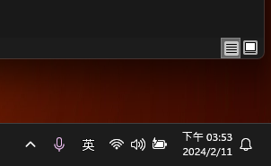

# 使用方式

## 基本使用

@ 透過小老鼠可以 召喚功能

透過 ctrl+j 可以打開側邊欄位

ctrl+e 可以開啟原始碼

## 圖片設定使用

> 為了可以讓 圖片默認相對位置 ， C+V貼上的時候不需要手動調整位置


### 圖片改為相對位置連接才能夠github顯示

## setting 設定





## git 操作供比對

```batch
C:\Users\tt103\Desktop\LearnMarkText>git add .

C:\Users\tt103\Desktop\LearnMarkText>git commit --amend -m "圖片絕對位置+ 替代文字"
[master 8dc58f4] 圖片絕對位置+ 替代文字
 Date: Sun Feb 11 15:44:44 2024 +0800
 1 file changed, 1 insertion(+), 5 deletions(-)

C:\Users\tt103\Desktop\LearnMarkText>git push
To https://github.com/lcw900914/MyNote
 ! [rejected]        master -> master (non-fast-forward)
error: failed to push some refs to 'https://github.com/lcw900914/MyNote'
hint: Updates were rejected because the tip of your current branch is behind
hint: its remote counterpart. Integrate the remote changes (e.g.
hint: 'git pull ...') before pushing again.
hint: See the 'Note about fast-forwards' in 'git push --help' for details.

C:\Users\tt103\Desktop\LearnMarkText>git log
commit 8dc58f4306a840f1ac5f5cde09448e5c5c577848 (HEAD -> master)
Author: lcw900914 <lcw900914@gmail.com>
Date:   Sun Feb 11 15:44:44 2024 +0800

    圖片絕對位置+ 替代文字

commit 35a48b45b680dc670e3ff12d77ffab84fcf2aaf5
Author: lcw900914 <lcw900914@gmail.com>
Date:   Sun Feb 11 15:42:49 2024 +0800

    first commiit

C:\Users\tt103\Desktop\LearnMarkText>git push --force origin master
```
