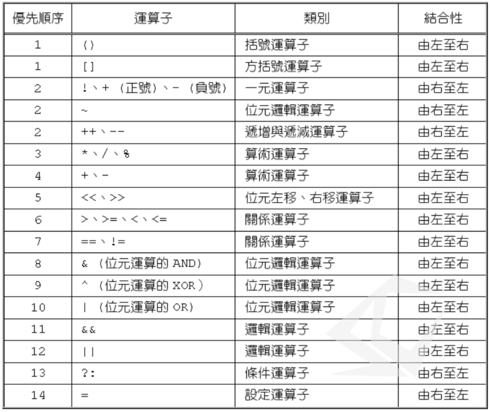

# 運算子

> 說到運算子就不得不提到運算式，我們在寫程式會以分號來分隔不同的敘述，運算式是敘述的子集，而在運算式裡面會有運算子與運算元。變數或常數就是一種運算元，而加減乘除與賦值就算是運算子，至少一個運算元與至少一個運算子可以組成一個運算式。

#### 一元運算子

- +正

- -負

- !  反 (運算元的型別必須是`boolean`)

- ~ 取1的補述

#### 算術運算子

- 加

- 減

- 乘

- 除

- 取餘

關係運算子

- .>

- <

- .>=(去點)

- <=

- ==

- !=

#### 遞增遞減運算子

- ++
- .--

#### 邏輯運算子

- &&

- ||

#### 優先序(重要)

