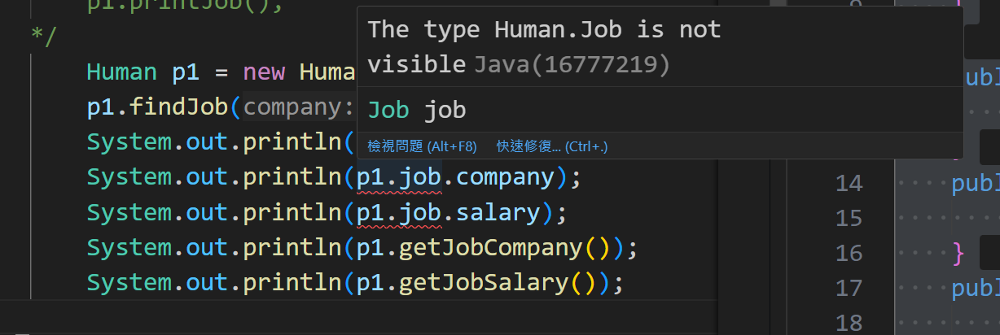

# 類別與物件

> 在定義類別後就可以新增依照此類別所建立的物件。所以類別是虛的，而物件是實際存在的。舉個例子來說，車子誕生的兩大步驟，設計(類別)與製造(建構子)，最終產出新車(物件)。車商會先設計完車子的配備(外觀與配備)，再交由製造商依照設計圖去生產，最後製造完成可以被使用了。

#### 巢狀類別

​	類別中有另一個類別，以下是示範。

```java
class Human{
    String name;
    int age;
    
    Human(String name){
        this.name = name;
        this.age = 0;
    }
    
    class Job{
        String company;
        int salary;
    }
}
```

```java
public class World {
   public static void main(String[] args) {
        Human p1 = new Human("David");
        Human.Job job = p1.new Job();
        job.company = "Lethal";
        System.out.println(p1.name + " : " + job.company);
   } 
}
/*
output:
David : Lethal
*/

```


#### public and private

​	如果你將變數前面加上public 或是 private，public的變數在非此物件外面也可以被存取及修改，而private的變數則不能被存取與修改。

```java
class Human{
    public String name;
    private int age;
    
    Human(String name){
        this.name = name;
        this.age = 0;
    }
}
```

```java
public class World {
   public static void main(String[] args) {
        Human p1 = new Human("David");
        System.out.println(p1.name);
        System.out.println(p1.age);
   } 
}

```

錯誤，沒辦法存取p1.age。


那要怎麼存取或修改某個物件中private的變數?在類別中寫一個函式!

```java
class Human{
    public String name;
    private int age;
    
    Human(String name){
        this.name = name;
        this.age = 0;
    }
    public void setAge(int age){
        this.age = age;
    }
    public int getAge(){
        return this.age;
    }
}
```

```java
public class World {
   public static void main(String[] args) {    
        Human p1 = new Human("David");
        System.out.println(p1.getAge());
        p1.setAge(20);
        System.out.println(p1.getAge());
   } 
}
/*
output:
0
20
*/

```


##### 補充

> 巢狀類別中，外部類別與內部類別可以互相使用屬性，即便屬性為private。但是private類別的public物件在其他類別中除了自身為public以外，其餘屬性與方法仍是private的，無法直接被存取。

```java
class Human{
    public String name;
    private int age;
    public Job job;

    Human(String name){
        this.name = name;
        this.age = 0;
    }
    
    public void setAge(int age){
        this.age = age;
    }
    public int getAge(){
        return this.age;
    }
    public int getJobSalary(){
        return this.job.salary;
    }
    public String getJobCompany(){
        return this.job.company;
    }

    public void findJob(String company, int salary){
        this.job = new Job(company, salary);
    }

    private class Job{
        public String company;
        private int salary;
        Job(String company, int salary){
            this.company = company;
            this.salary = salary;
        }
    }
}
```

```java
public class World {
   public static void main(String[] args) {
        Human p1 = new Human("David");
        p1.findJob("Lethal", 150);
        System.out.println(p1.job);
        System.out.println(p1.job.company);
        System.out.println(p1.job.salary);
        System.out.println(p1.getJobCompany());
        System.out.println(p1.getJobSalary());

   } 
}
```




而在巢狀內的外部類是可以使用內部類所有的屬性，可以看到this.job.salary在巢狀中的外部類別是可以被使用的

!

##### 補充的結論

> 所以巢狀類別中的內部類別如果設為private的話，那他的屬性就可以不必在意為public或是private。但是如果內部類別使用public，請記得將其屬性的訪問權限設定好，因為如果`內部類別使用public`與`外部類別在新增內部類別的物件時使用public`，會導致其他類別可以直接訪問內部類別的屬性。


