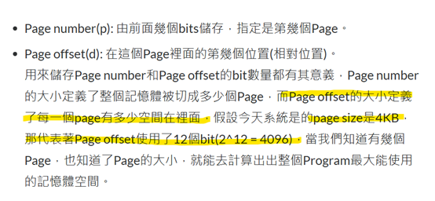
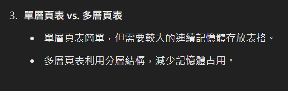
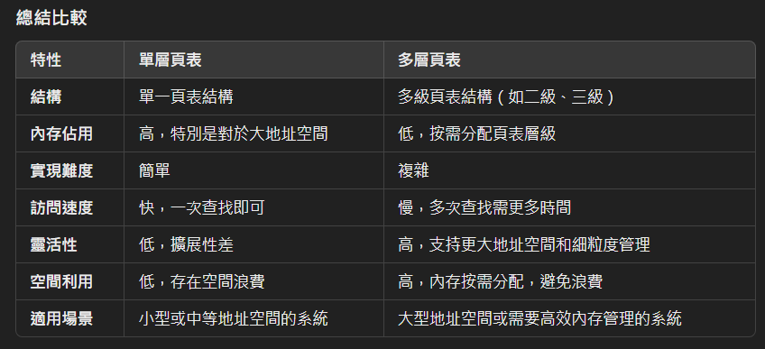

其實還有一個好處，就是共用同一個記憶體，ex: dll。



多層列表: 我的資料是放別人的index。(I am library) 



雖然多層頁表通過分層結構有效節省了內存，並支持更大的虛擬地址空間，但層數過多會帶來地址轉換延遲增加、內存開銷增大、TLB命中率下降、管理複雜性提升、快取壓力增大以及硬件支持需求提高等一系列問題。

------

### **題目**

假設一個 **22 位元** 的虛擬位址空間，頁大小為 **2^13 = 8192 B**（8 KB），分頁結構採用單層頁表。若虛擬位址為 `0x2F4A3`，頁表內容如下：

- 頁 0 → 框 3
- 頁 1 → 框 5
- 頁 23 → 框 12
- 頁 47 → 框 30

請計算對應的實體位址。若頁號無對應的框，則返回「Page Fault」。

------

### **解答**

#### **步驟 1：分解虛擬位址**

虛擬位址為 `0x2F4A3`，轉換步驟如下：

1. **頁大小為 2^13 = 8192 B**，故虛擬位址中：

   - 高位表示 **頁號（Page Number）**，
   - 低位表示 **偏移量（Offset）**。

2. **計算頁號（Page Number）**：

   ```
   頁號 = 虛擬位址 / 頁大小
        = 0x2F4A3 / 8192
        = 0x2F4A3 / 0x2000
        = 23（十進位）。
   ```

3. **計算偏移量（Offset）**：

   ```
   偏移量 = 虛擬位址 % 頁大小
          = 0x2F4A3 % 8192
          = 0x4A3（十六進位）。
   ```

------

#### **步驟 2：查找頁表**

- 頁號 `23` → 框 `12`（頁表中有對應的框號）。

------

#### **步驟 3：計算實體位址**

實體位址計算公式：

```
實體位址 = 框號 × 頁大小 + 偏移量
```

代入數值：

```
實體位址 = 12 × 8192 + 0x4A3
         = 98304 + 1187
         = 99491（十進位）
         = 0x184A3（十六進位）。
```

------

### **答案**

對應的實體位址為：

```
0x184A3
```

------

