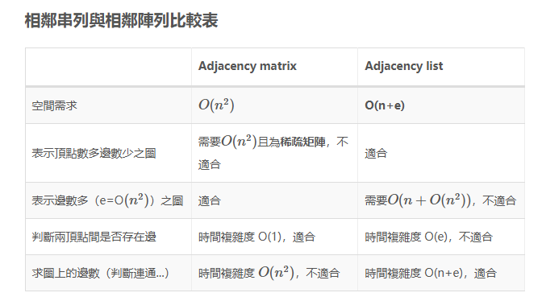
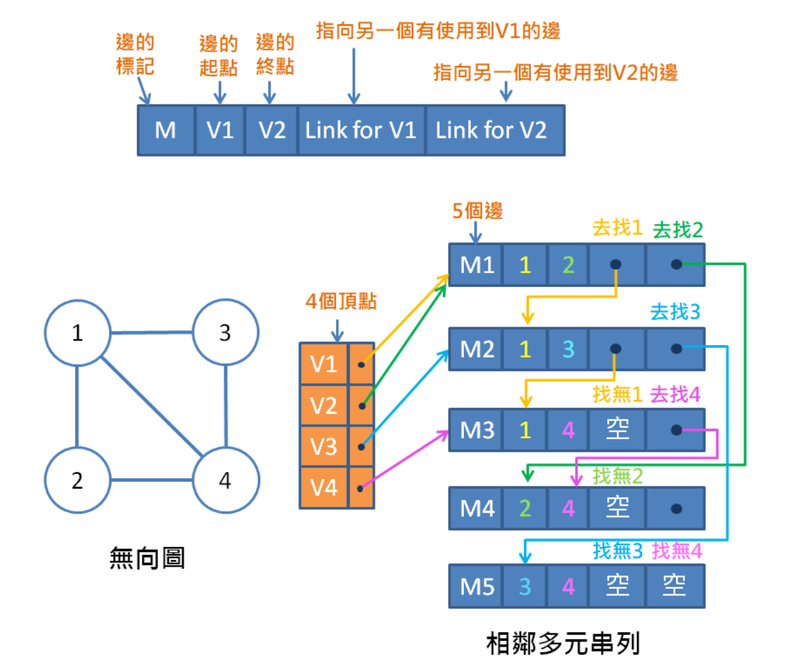
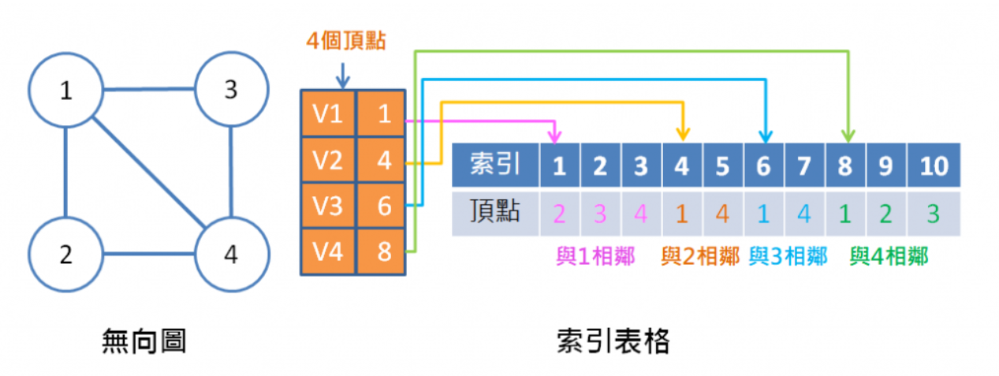

# 圖

​	圖是由兩個集合組成的分別是V以及E。

​	Vertices 頂點 -> V 頂點集合。

​	Edge 邊 ->E 邊集合，集合內的元素會用兩個頂點(V1,V2)來表示。


### 有向圖 Directed Graph

​	E(V1, V2) != E(V2, V1)

​	E(Tail尾巴, Head頭) :   尾 -> 頭

​	n個頂點的有向圖，最多有 n * (n - 1)條邊。

### 無向圖 Undirect Graph

​	E(V1, V2) == E(V2, V1)

​	對於頂點i的分支度為di，有n個頂點的無向圖，邊的數量為 e = 1/2 * Σ1~n : (di)

### Complete Graph

​	n個頂點的無向圖，Vi != Vj (元素不重複)且邊不重複的情況下，具有n * (n - 1) / 2。	

### Sub Graph

​	如果要說a是b的子圖，子圖a必須包含於圖b，更精確來說是

​	(V(a)包含於 V(b)) && (E(a)包含於E(b)) 

### Path

​	一個序列由頂點所組成。

​	Path Length : path包含邊的數量

### Cycle

​	simple path && 起點終點為相同頂點。

### Connected

​	一個無向圖是否為Connected，就看能不能從隨機一個頂點走訪圖中其餘的頂點。

### Connected Components

​	如果一個圖的子圖，是Connected，就會稱這個子圖是圖的Connected Components

### Strongly Connected 

​	在有向圖中，如果所有相異的兩個頂點Vi,Vj，都有(Vi ,Vj)及(Vj,Vi)這兩個相反方向的邊時，就稱此圖為strongly Connect。

### Strongly Connected Component

​	子圖是Strongly Connected時，稱子圖為圖的Strongly Connected Component。

### Degree & In-Degree & Out-Degree

​	Degree: 無向圖G的頂點V，他的分支度為，存在V節點的邊總數。

​	In-Degree: 有向圖中G的頂點V，他的分支度為，存在V節點於head(頭)的邊總數。

​	Out-Degree: 有向圖中G的頂點V，他的分支度為，存在V節點於tail(尾)的邊總數。

### 

## 圖形的儲存方法

1. 相鄰矩陣 
2. 相鄰串列
3. 相鄰多元串列
4. 索引表

|      | 相鄰矩陣                                                     | 相鄰串列                                                     |
| ---- | :----------------------------------------------------------- | :----------------------------------------------------------- |
| 簡述 | 一個n*n的二元陣列A，<br />如果Vi->Vj，A[ i ] [ j ] = 1<br />如果Vj->Vi，A[ j ] [ i ] = 1<br />在無向圖中，這個陣列以i=j對稱<br /> | 相鄰串列的結構為<br />struct HeadNode{<br />Vertex<br />VertexLink(s)<br />}<br /> 一個n個節點的圖總共會有n個HeadNode<br />無向圖的VertexLink數量，為Vertex的分支度<br />有向圖的VertexLink數量，為Vertex的向外分支度<br /> |
| 優點 | 找E(Vi, Vj)的時間為O(1)<br />表達無向圖時可以省下一半的空間<br />分支度計算方便(in and out)<br /> | 無向圖中計算邊的各數時間複雜度為O(n+e)<br />因為遍歷每個頂點O(n)遍歷每個頂點的相鄰Link O(2e)<br />有向圖中特定頂點n的向外分支度為n的VertexLink總數<br /> |
| 缺點 | 浪費空間<br />n為節點數時 :<br />計算邊總數的時間複雜度一定為O(n^2)<br />G是否為Connected的時間複雜度為O(n^2)<br /> | 無向圖中VertrxLink總數為邊的兩倍<br />有向圖中求向內分支度較困難，需使用返鄰串列。 |



​					來源 : https://wangwilly.github.io/willywangkaa/2018/12/02/Data-structure-graph/


|      | 多元相鄰串列                                                 |
| ---- | ------------------------------------------------------------ |
| 簡介 | 以邊為一個單位<br />struct AdjacencyMultilist {<br />bool Mark 表示是否已搜尋<br />string V1<br />string V2<br />AdjacencyMultilist V1Link<br />AdjacencyMultilist V2Link<br />}<br /><br /> |




|      | 索引表格法                                                  |
| ---- | ----------------------------------------------------------- |
| 簡介 | 會有一個大小為n*2的array，存放Vi在另一個一維陣列的起始index |




## Traversal

​	使用相鄰陣列結構來儲存graph

​	DFS 相鄰矩陣O(n^2)


```C++
//遞迴深搜 圖
#include <iostream>
using namespace std;

char G[8][8] = {
    {0,1,1,0,0,0,0,0},
    {1,0,0,1,1,0,0,0},
    {1,0,0,0,0,1,1,0},
    {0,1,0,0,0,0,0,1},
    {0,1,0,0,0,0,0,1},
    {0,0,1,0,0,0,0,1},
    {0,0,1,0,0,0,0,1},
    {0,0,0,1,1,1,1,0}
};

bool mark[8] = {false,false,false,false,false,false,false,false};

void DFS(int V1) {
	mark[V1] = true;
	cout<<V1+1<<" ";
    for(int V2 = 0; V2 < 8; V2++){
		if(!mark[V2] && G[V1][V2] == 1)DFS(V2);
    }
}

int main() {
	cout << "DFS Traversal :" << endl;
	for(int i = 0; i < 8; i++)if(!mark[i])DFS(i);
    system("pause");
}

```

​	BFS

```C++
//迴圈廣搜 圖
#include <iostream>
#include <queue>
using namespace std;

queue <int> Q;

char G[8][8] = {
   //1,2,3,4,5,6,7,8
    {0,1,1,0,0,0,0,0},//1
    {1,0,0,1,1,0,0,0},//2
    {1,0,0,0,0,1,1,0},//3
    {0,1,0,0,0,0,0,1},//4
    {0,1,0,0,0,0,0,1},//5
    {0,0,1,0,0,0,0,1},//6
    {0,0,1,0,0,0,0,1},//7
    {0,0,0,1,1,1,1,0} //8
};

bool mark[8] = {false,false,false,false,false,false,false,false};

void BFS(int V1) {
	Q.push(V1);
    mark[V1] = true;
    cout << V1+1 << " ";
    while(true){
        if(Q.empty()){
            //可以檢查mark是否全是true，訪問那些還是false的index。
            bool flag = false;
            for(int i = 0; i < 8; i++) {
                if(mark[i] == false){
                    flag = true;
                    Q.push(i);
                    break;
                }
            }
            if(!flag)break;
        }
        //從佇列拿一個元素V1
        int V1 = Q.front();
        Q.pop();
        //遍歷V1與其他節點的關係
        for(int i = 0; i < 8; i++) {
            // V1與節點i有路可走，而且節點i還沒被走過
            if(G[V1][i] == 1 && !mark[i]){
                //先把這個i節點放入柱列，且標記i走過了
                Q.push(i);  
                mark[i] = true;
                cout << i+1 << " ";
            }
        }
    }  
}

int main() {
    cout << "BFS Traversal :" << endl;
    BFS(0);
    system("pause");
}
```


## 展開樹Spanning Tree

​	定義

​	特質

​	性質

​	最小成本展開樹:

​		實作方法

​			1.Kruskal

​			2.Prim

​			3.Sollin